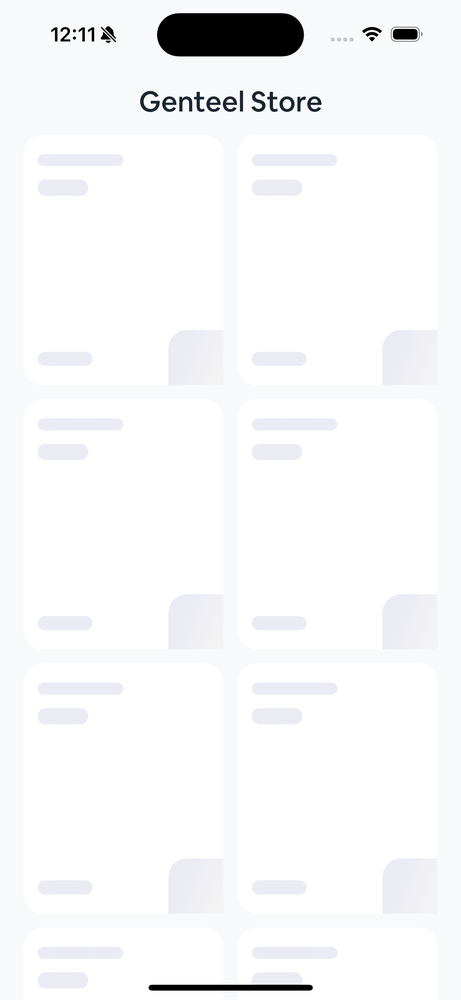

# genteel_store

A new Flutter project.

## Getting Started
Genteel Store Ecommerce Application is a **Retail** Application which display products from the **Timbu cloud** API, it fetches the products and displays it accordingly to the user.

**Font used**
|- AirbnbCereal: i choose this because of the fluidity it add to the user interface

it contains just 1 screens
|- Product list screen which list the Products fetched from the API

## Folder Structure
|- Controller
    |- This contains and provide any screen logic to its corresponding view which make the screen more readable and flexible to understand and work with 
|- View
    |- This only takes the widget implementation of the Screen and calls the controller for any screen logic
|- Cubit(state management)
    |- Handles the Result of the Services globally and passes the result to the Screens
|- Repository
    |- Connects the Services(Remote and Database) to the State management
|- Services
    |- Api service which made use of Dio(Fluter package) to fetch product from the server
|- Widget
    |- Product error widget which displays the error widget
    |- Product item widget which contains the UI for product list
    |- Product loading widget which displays the loading state of the product fetch

## Architecture Pattern
|- MVC(Model-View-Controller)
    |- This gives the codebase more flexibility as there are much separation of concern between different part of the code

|- Repository Pattern
    |- This pattern requires the connection between the api call and the state management(Cubit)

|- Bloc Pattern
    |- This pattern complement the repository pattern by providing the api response to the Screen(UI)

**Let's talk about the model classes**
|- Model Class
    |- ProductData model class which is a blueprint of the Product object

## Screenshot

## Project Link
|- Github
    |- ["Github link"](https://github.com/genteel25/retail_store)
|- Appetize.io
    |- ["Appetize project link"](https://appetize.io/app/android/com.example.genteel_store?device=pixel7&osVersion=13.0)
|- Google Drive
    |- ["Google Drive link"](https://drive.google.com/file/d/1pEPpy-uuS31mNxenVUqm9OERUQCKjvte/view?usp=sharing)
    
